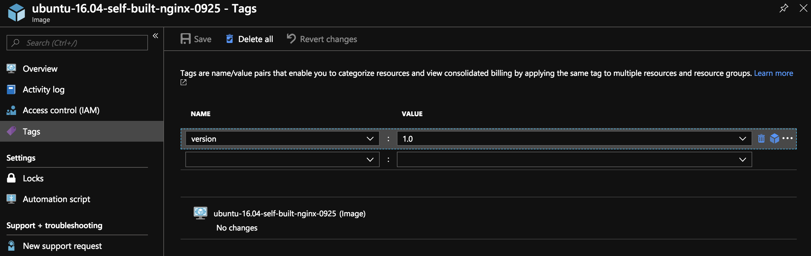

# Automate Image Building on Azure with `Packer`

## Version History

         +------------+------------+----------------+----------------------+
         |    Date    |   Version  |     Author     |         Notes        |
         +------------+------------+----------------+----------------------+
         | 2018/09/20 |     0.1    |    Wayne Lin   |    Initial version   |
         +------------+------------+----------------+----------------------+
         |            |            |                | Include Topics       |
         | 2018/09/24 |     0.5    |    Wayne Lin   | Suggested by Michael |
         |            |            |                | from Cycle Team      |
         +------------+------------+----------------+----------------------+

# Overview

To create VM on Azure, the first thing you need to decide is the `base image` for the VM.
There are lots of images on Azure Marketplace which were checked and certified by Azure and provided by:

- OS vendors including - Microsoft, RedHat, SUSE, Canonical and other vendors.
- Application vendors including - Wordpress, MongoDB, Oracle, Joomla! and other vendors.

It's also common to build `custom image` for various purposes like:

- Security
- Size
- Performance
- Boot time
- Have fixed environment for application

To create an `image` on Azure, the flow would be:

1. `Create/provision` a running VM from existing/marketplace image
2. Update and modify files/configurations on the VM
3. `Deprovision` the VM - this action make the VM `generalized`, and eligible for conversion to managed image
4. Capture VM as `image`

The key is `defining expected state of VM` as base to create other VMs.
Configure and update settings on VM might be simple or extremely complicated depends on different requirements, and
it's usually a back and forth process to test/verify whether the image meets expectation.
Usually, we will try to `implement step (2) with script` for `repeatable and trackable`:

- unify the steps/operations/commands to avoid typo or error
- make the current/future changes testable
- make the current/future changes trackable

We also want to avoid do step (1), (3) and (4) manually - because it's time consuming and error-prone, and that's the reason why we want to use tools like `Packer`.

# Limits on Azure Image

Before introducing `Packer`, we need to know several rules/limitions about the Image on Azure:

- maximum number of VMs based on `custom VM image` in an VM scale set is `600`
- default limit for number of managed Image is `10,000` and maximum limit is `50,000`

# Introduction to `Packer`

## What's `Packer` and What It Can Do?

[HashiCorp Packer](https://www.packer.io/intro/index.html) is easy to use and `automates the creation of any type of machine image`. It embraces modern
`configuration management` by encouraging you to use `automated scripts` to install and configure the software within your `Packer-made images`.
Packer brings machine images into the modern age, unlocking untapped potential and opening new opportunities.

Packer was implemented with `golang`, and the source code can be accessed on Github at:

- https://github.com/hashicorp/packer

Currently, Packer is able to provision and `build image` automatically `on Azure` and `most of major cloud vendors`.

## How Packer Works

To use Packer, we have to understand the major building blocks of Packer:

- Artifacts
   - `results of a single build` - it will be a `set of IDs or files` (depends on the vendor where you are building image) represent a `machine image`
- Builds
   - a single task that eventually produces an image for a single platform. `multiple builds` run in parallel.
- Builder
   - are components of Packer that are able to create machine image for a single platform.
- Commands
   - are sub-commands for the packer program that perform some job, for example - `build`.
- Post-processors:
   - are components of Packer that take the result of a builder or another post-processor and process that to create a new artifact
- Provisions:
   - are components of Packer that install and configure software within a running machine prior to that machine being turned into a static image.
- Templates:
   - are JSON files which define one or more builds by configuring the various components of Packer.

The conceptual flow to build packer is:

```
      +--------------------+ 
      | Edit JSON template |
      +--------------------+
                 |
                 V
      +--------------------+
      | Run `packer build` |
      +--------------------+
                 |
                 V
      +--------------------+
      |   Provision VM     |
      |  (with Builder)    |
      +--------------------+
                 |
                 V
      +--------------------+
      |     Setup VM       |
      | (with Provisioner) |
      +--------------------+
                 |
                 V
      +-----------------------+
      |    Process Image      |
      | (with Post-Processor) |
      +-----------------------+
```

## Quick Start - Install, Setup and Build Image with Packer

To build image on Azure with packer , there are several prerequieistes to meet:

- have packer installed
- have valid subscription and service principal created on Azure
- have valid JSON template file for packer

### Install Packer

Download packer binary from [download page](https://www.packer.io/downloads.html).
Take Linux x64 for example, you can download from:

- https://releases.hashicorp.com/packer/1.3.1/packer\_1.3.1\_linux\_amd64.zip

Please take following commands for your reference:

```bash
      # create directory and change working directory
      mkdir ~/packer && cd ~/packer
      
      # download with wget
      wget https://releases.hashicorp.com/packer/1.3.1/packer_1.3.1_linux_amd64.zip
      
      # unzip packer
      unzip packer_1.3.1_linux_amd64.zip -d .
      
      # run packer command for test
      ./packer --help
```

### Create Service Principal for Packer to Build Image

We will need `subscription id` and info of `service principal` to build image.
For subscription id, you can get your subscription id with following command:

```bash
      az account list --query "[?isDefault].id"
```

upon completion of this command, you will see output like:

```json
        [
          "<subscription-id>"
        ]
```

You can create a service principal easily with Azure CLI with following command:

```bash
      az ad sp create-for-rbac -n PackerSP --years 1
```

up completion of this command, you will see output like:

```json
        {
          "appId": "<app-id>",
          "displayName": "PackerSP",
          "name": "http://PackerSP",
          "password": "<app-secret>",
          "tenant": "<tenant-id>"
        }
```

Now, you have all necessary information need to build image with Packer.
Let's use packer to build a image from Ubuntu 16.04 and have sshguard installed on it in next section.

### Create JSON Template and Build Image with Packer
      
We can take a simple Packer template file - ubuntu.json for example:

```json
    {
       "builders": [
          {
            "type": "azure-arm",
            "client_id": "<app-id-of-service-principal>",
            "client_secret": "<app-secret-of-service-principal>",
            "subscription_id": "<subscription-id>",
            "tenant_id": "<tenant-id>",
            "os_type": "Linux",
            "image_publisher": "Canonical",
            "image_offer": "UbuntuServer",
            "image_sku": "16.04-LTS",
            "azure_tags": {
              "<name-of-tag-to-add>": "<value-of-tag>"
            },
            "location": "southeastasia",
            "vm_size": "Standard_A2",
            "managed_image_name": "ubuntu-16.04-self-built-20180920",
            "managed_image_resource_group_name": "<resource-group>"
          }
       ],
       "provisioners": [
          {
             "type": "shell",
             "inline": [
                "sudo apt-get -y update",
                "sudo apt-get install -y sshguard"
             ]
          },
          {
             "execute_command": "chmod +x {{ .Path }}; {{ .Vars }} sudo -E sh '{{ .Path }}'",
             "inline": [
               "/usr/sbin/waagent -force -deprovision && export HISTSIZE=0 && sync"
             ],
             "inline_shebang": "/bin/sh -x",
             "type": "shell"
          }
       ]
    }
```

if you have packer installed, you can check whether the syntax in your template is correct or not with this command:

```bash
      packer validate ubuntu.json
```

after that, use this command to build your first auto-build image:

```bash
      packer build ubuntu.json
```

If everything works fine, you will see output and log from packer while provision and building your image.
If something is wrong, don't worry. You can edit your JSON tempalte and fire `packer build ubuntu.json` again.

## Advanced Examples

### Build Image from Custom Image on Azure

Assume in previous section, we've build a image `ubuntu-16.04-self-built-20180920`.
We can build other image based `ubuntu-16.04-self-built-20180920`, and install other software and configure for other purpose.
For example, we will install `nginx` on the newly created VM based `ubuntu-16.04-self-built-20180920`.
Please check following JSON template:

```json
    {
       "builders": [
          {
            "type": "azure-arm",
            "client_id": "<app-id-of-sp>",
            "client_secret": "<app-secret-of-sp>",
            "subscription_id": "<scription-id>",
            "tenant_id": "<tenant-id>",
            "os_type": "Linux",
            "custom_managed_image_name": "ubuntu-16.04-self-built-20180920",
            "custom_managed_image_resource_group_name": "<src-image-resource-group-name>",
            "azure_tags": {
              "<tag-name>": "<tag-value>"
            },
            "location": "southeastasia",
            "vm_size": "Standard_A2",
            "managed_image_name": "ubuntu-16.04-self-built-nginx",
            "managed_image_resource_group_name": "<dst-image-resource-group-name>"
          }
       ],
       "provisioners": [
          {
             "type": "shell",
             "inline": [
                "sudo apt-get install -y nginx"
             ]
          },
          {
             "execute_command": "chmod +x {{ .Path }}; {{ .Vars }} sudo -E sh '{{ .Path }}'",
             "inline": [
               "/usr/sbin/waagent -force -deprovision+user && export HISTSIZE=0 && sync"
             ],
             "inline_shebang": "/bin/sh -x",
             "type": "shell"
          }
       ]
    }
```

### Build Image `without Exposing Public IP` on VM

To use this approach, there are some prerequisites must be met:

- install packer on Azure VM, and the VM must be on the VNET to build the image
- the VNET must allow outbound internet access, since the build VM need to call Azure Resource Manager API
- run `packer build` on Azure VM instead of on your computer

please check following template for your reference:

```json
    {
       "builders": [
          {
            "type": "azure-arm",
            "client_id": "<app-id-of-sp>",
            "client_secret": "<app-secret-of-sp>",
            "subscription_id": "<subscription-id>",
            "tenant_id": "<tenant-id>",
            "os_type": "Linux",
            "custom_managed_image_name": "ubuntu-16.04-self-built-20180920",
            "custom_managed_image_resource_group_name": "<src-image-resource-group-name>",
            "azure_tags": {
              "<tag-name>": "<tag-value>"
            },
            "location": "southeastasia",
            "vm_size": "Standard_A2",
            "managed_image_name": "ubuntu-16.04-self-built-nginx-no-pip",
            "managed_image_resource_group_name": "packer-build",
            "private_virtual_network_with_public_ip": false,
            "virtual_network_name": "<vnet-name>"
          }
       ],
       "provisioners": [
          {
             "type": "shell",
             "inline": [
                "sudo apt-get install -y nginx"
             ]
          },
          {
             "execute_command": "chmod +x {{ .Path }}; {{ .Vars }} sudo -E sh '{{ .Path }}'",
             "inline": [
               "/usr/sbin/waagent -force -deprovision+user && export HISTSIZE=0 && sync"
             ],
             "inline_shebang": "/bin/sh -x",
             "type": "shell"
          }
       ]
    }
```

### Build Image with External Files/Scripts based on Custom Image on Azure

It's also possible to `upload and run configuration/scripts` and other files you want during setup and build your image!
You can add text file and script in packer directory:

- test.txt
- test.sh

the content of test.sh is:

```bash
        #!/bin/bash

        sudo apt-get install -y apache2-utils
```

and the content of test.txt is:

```
        test
        test
```

and please check following template:

```json
    {
       "builders": [
          {
            "type": "azure-arm",
            "client_id": "<app-id-of-sp>",
            "client_secret": "<app-secret-of-sp>",
            "subscription_id": "<subscription-id>",
            "tenant_id": "<tenant-id>",
            "os_type": "Linux",
            "custom_managed_image_name": "ubuntu-16.04-self-built-20180920",
            "custom_managed_image_resource_group_name": "<src-image-resource-group-name>",
            "azure_tags": {
              "<tag-name>": "<tag-value>"
            },
            "location": "southeastasia",
            "vm_size": "Standard_A2",
            "managed_image_name": "ubuntu-16.04-self-built-nginx-no-pip-with-apache2-utils",
            "managed_image_resource_group_name": "<dst-image-resource-group-name>",
            "private_virtual_network_with_public_ip": false,
            "virtual_network_name": "<vnet-name>"
          }
       ],
       "provisioners": [
          {
             "type": "file",
             "source": "test.txt",
             "destination": "/tmp/test.txt"
          },
          {
             "type": "file",
             "source": "test.sh",
             "destination": "/tmp/test.sh"
          },
          {
             "type": "shell",
             "inline": [
                "sudo chmod u+x /tmp/test.sh",
                "sudo /tmp/test.sh",
                "sudo apt-get install -y nginx"
             ]
          },
          {
             "execute_command": "chmod +x {{ .Path }}; {{ .Vars }} sudo -E sh '{{ .Path }}'",
             "inline": [
               "/usr/sbin/waagent -force -deprovision+user && export HISTSIZE=0 && sync"
             ],
             "inline_shebang": "/bin/sh -x",
             "type": "shell"
          }
       ]
    }
```

### Build Image as VHD

Note:
   - the VHD will be captured at `https://<storage_account>.blob.core.windows.net/system/Microsoft.Compute/Images/<capture_container_name>/<capture_name_prefix>.xxxxxxxx-xxxx-xxxx-xxxx-xxxxxxxxxxxx.vhd`

Please check following JSON template:

```json
    {
       "builders": [
          {
            "type": "azure-arm",
            "client_id": "<app-id-of-sp>",
            "client_secret": "<app-secret-of-sp>",
            "subscription_id": "<subscription-id>",
            "tenant_id": "<tenant-id>",
            "os_type": "Linux",
            "image_publisher": "Canonical",
            "image_offer": "UbuntuServer",
            "image_sku": "16.04-LTS",
            "azure_tags": {
              "<tag-name>": "<tag-value>"
            },
            "location": "<location>",
            "vm_size": "Standard_A2",
            "capture_container_name": "<container-name>",
            "capture_name_prefix": "<vhd-prefix>",
            "storage_account": "<storage-account>",
            "resource_group_name": "<resource-group-name>"
          }
       ],
       "provisioners": [
          {
             "type": "shell",
             "inline": [
                "sudo apt-get -y update",
                "sudo apt-get install -y sshguard"
             ]
          },
          {
             "execute_command": "chmod +x {{ .Path }}; {{ .Vars }} sudo -E sh '{{ .Path }}'",
             "inline": [
               "/usr/sbin/waagent -force -deprovision+user && export HISTSIZE=0 && sync"
             ],
             "inline_shebang": "/bin/sh -x",
             "type": "shell"
          }
       ]
    }
```

### Leverage Variable to Customize Your Image Build Process

For the examples listed above, you should be familiar with JSON template of Packer now,
and you should have requirements to specify setting (e.g., subscription id, name of resource group, image name ...) in template dynamically.
To do something like this, there are several options on Packer:

1) packer variable
2) environment variable
3) variable file
4) [consul](https://www.consul.io/) key
5) [vault](https://www.vaultproject.io/) key

To simplify this tutorial, we will cover option (1) ~ (3) here.
As we called the JSON file that instruct packer to build image a `template`, you might guess that we can `add reference to variable` in the template file.
Before having a complete sample JSON template, let's take a look on the `different ways to specify variables` in packer templates:

- packer variable
   - those variables defined with packer command, for example:

```
      packer build -var "subscription_id=xxxxxxx-xxxxxxx-xxxxxxx" -var "resource_group_name=test" build.json
```

- environment variable
   - those variables defined as environment variable in shell

```bash
#specify variable while running packer
subscription_id=xxxxxxx-xxxxxxx-xxxxxxx resource_group_name=test packer build build.json

#or, you can use export to set variables before running packer
export subscription_id=xxxxxxx-xxxxxxx-xxxxxxx
export resource_group_name=test
packer build build.json
```

- variable file
   - you can define the definitions of your variable in JSON file like:

```
# file content of var.json
{
"subscription_id": "xxxxxxx-xxxxxxx-xxxxxxx",
"resource_group_name": "test"
}

# then you can use -var-file to use your variable definition while run packer
packer build -var-file=var.json build.json
```

To build image with variables, please check followingpacker command:

```bash
      # use packer command to build
      packer build -var "client_id=xxxxxxx-xxxxxx-xxxxxxx" \
         -var "client_secret=zzz-zzzzzz-zzzzzz-zzzz" \
         -var "subscription_id=xxxxxx-xxxxxx-xxxxxxx-" \
         -var "tenant_id=72f988bf-86f1-41af-91ab-2d7cd011db47" \
         -var "version=1.0" -var "date=0925" \
         build.json

      # or, you can have variable file to specify variable
      packer build -var-file=var.json build.json
```

also check following JSON template:

```json
    {
       "variables": {
          "client_id": "default",
          "client_secret": "default",
          "subscription_id": "default",
          "tenant_id": "default",
          "version": "default",
          "date": "default"
       },
       "builders": [
          {
            "type": "azure-arm",
            "client_id": "{{user `client_id`}}",
            "client_secret": "{{user `client_secret`}}",
            "subscription_id": "{{user `subscription_id`}}",
            "tenant_id": "{{user `tenant_id`}}",
            "os_type": "Linux",
            "custom_managed_image_name": "ubuntu-16.04-self-built-20180920",
            "custom_managed_image_resource_group_name": "packer-build",
            "azure_tags": {
              "version": "{{user `version`}}"
            },
            "location": "southeastasia",
            "vm_size": "Standard_A2",
            "managed_image_name": "ubuntu-16.04-self-built-nginx-{{user `date`}}",
            "managed_image_resource_group_name": "packer-build"
          }
       ],
       "provisioners": [
          {
             "type": "shell",
             "inline": [
                "sudo apt-get install -y nginx"
             ]
          },
          {
             "execute_command": "chmod +x {{ .Path }}; {{ .Vars }} sudo -E sh '{{ .Path }}'",
             "inline": [
               "/usr/sbin/waagent -force -deprovision+user && export HISTSIZE=0 && sync"
             ],
             "inline_shebang": "/bin/sh -x",
             "type": "shell"
          }
       ]
    }
```

after build command completes, you will see `version` tag was added on created image like:



if you store and track all of changes of your build template and script with `git`, you can use git hash for your image versioning like:

```bash
      packer build -var "client_id=xxxxxxx-xxxxxx-xxxxxxx" \
         -var "client_secret=zzz-zzzzzz-zzzzzz-zzzz" \
         -var "subscription_id=xxxxxx-xxxxxx-xxxxxxx-" \
         -var "tenant_id=72f988bf-86f1-41af-91ab-2d7cd011db47" \
         -var "version=$(git rev-parse --short HEAD)" -var "date=$(date +%Y%m%d)" \
         build.json
```

### Common Questions

* is it possible to do conditional switch in JSON template?
   * Answer: not support in JSON template. however, we can use `variable + shell script/command` and do arguments checking in shell script, for example:

```json
        {
          "type": "shell-local",
          "command": "if [ ! -z \"{{user `do_nexpose_scan`}}\" ]; then python -u trigger_nexpose_scan.py; fi"
        }
```

